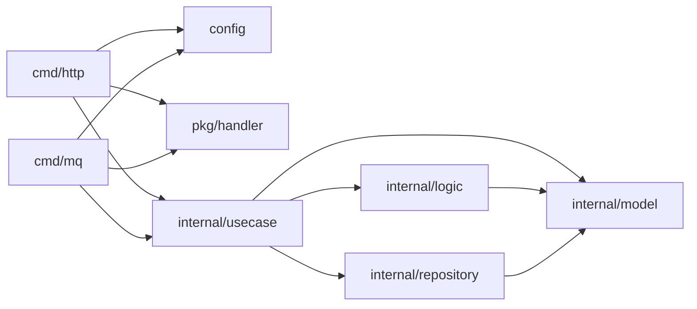

# High Modular Architecture Structure Guide

This repository is a bootstrap template for high-modular backend apps.
Use it when you want:
- clear separation between infrastructure and business logic
- high testability in usecase and logic
- reusable flow building blocks with thin repository adapters

Reference guideline:
- https://pro-daydreamer.medium.com/high-modular-architecture-specification-guideline-41a29779ba91

## Directory Map

### Infrastructure Layer

- `cmd/`
  - app entrypoints and binary targets
  - wire config, clients, usecases, and transport bindings
  - current targets:
    - `cmd/http` for HTTP serving
    - `cmd/mq` for NSQ consumers
- `config/`
  - app configuration structs and loading bootstrap
  - initialized once and injected into startup wiring
- `pkg/`
  - shared infrastructure utilities and abstractions
  - current modules:
    - `pkg/db` for DB init + transaction interface
    - `pkg/handler` for generic HTTP/NSQ adapters

### Business Layer (`internal/`)

- `internal/usecase/`
  - flow orchestration for business features
  - compose calls to logic + repository through repo interfaces
- `internal/logic/`
  - reusable static logic blocks (conversion, calculation)
  - accept interfaces for external dependency access
- `internal/repository/`
  - thin external-call wrappers (DB/API)
  - minimal logic; delegate conversions/algorithms elsewhere
- `internal/model/`
  - reusable domain structs shared across usecases

## Current Entrypoint Pattern

### HTTP (`cmd/http`)

1. Load config with `config.InitConfig()`
2. Initialize logic and repository modules
3. Build infra clients (`*sql.DB`, `*http.Client`)
4. Construct usecases
5. Bind usecases to generic handlers + routes
6. Start server

### MQ (`cmd/mq`)

1. Load config
2. Initialize logic and repository modules
3. Build clients and usecases
4. Register consumers with `handler.NewGenericConsumer`
5. Start NSQ consumers and handle graceful shutdown

## Dependency Direction



## Canonical Patterns In This Repo

### 1) Usecase Pattern

Keep usecase as orchestrator and keep hard-to-test calls behind an interface.

```go
type createOrderUsecase struct {
    repo iCreateOrderRepo
}

type iCreateOrderRepo interface {
    db.ITransaction
    GetPromotion(coupon string, totalPrice float64) (model.PromotionData, error)
    InsertOrder(tx *sql.Tx, order model.OrderData) (int64, error)
    InsertOrderItem(tx *sql.Tx, orderID int64, order model.OrderItem) error
}
```

Source: `internal/usecase/post_payment/create_order.go`

### 2) Logic Pattern

Use static reusable function with interface argument for external data fetch.

```go
type ICalculateTotalPrice interface {
    GetPromotion(coupon string, totalPrice float64) (model.PromotionData, error)
}

func CalculateTotalPrice(coupon string, items []model.CheckoutItem, itf ICalculateTotalPrice) (float64, error)
```

Source: `internal/logic/price/total_price.go`

### 3) Repository Pattern

Repository methods should stay thin and delegate to repository package functions.

```go
func (uc renderPageRepo) GetCartFromDB(userID int64) (model.CartData, error) {
    return tx_repo.SelectCartByUserID(uc.dbCli, userID)
}
```

Source: `internal/usecase/checkout/render_page.go`

### 4) Generic Transport Adapters

- HTTP generic adapter in `pkg/handler/handler.go`
- NSQ generic adapter in `pkg/handler/nsq.go`

These adapters handle deserialization + validation, then call usecase contracts.

## Bootstrap Checklist (New Feature Flow)

1. Add or update domain structs in `internal/model` only if they are shared.
2. Create a single-purpose usecase file in `internal/usecase/<entity>/`.
3. Define usecase input/output model and main method.
4. Define a repo interface inside the usecase file for all external calls.
5. Implement repo struct methods with thin wrappers to `internal/repository/*`.
6. Move reusable conversion/calculation blocks into `internal/logic/*` as static functions.
7. Wire new usecase in `cmd/http/init.go` or `cmd/mq/consumers.go`.
8. Attach transport binding:
   - HTTP route in `cmd/http/routes.go`, or
   - MQ consumer registration in `cmd/mq/consumers.go`.
9. Add/update gomock generation comments (`//go:generate mockgen ...`) for testable interfaces.
10. Keep business rules in usecase/logic; keep repository code minimal.

## Scope Of This Document

- This guide documents existing structure and intended bootstrap usage.
- It does not perform code cleanup or refactor by itself.
